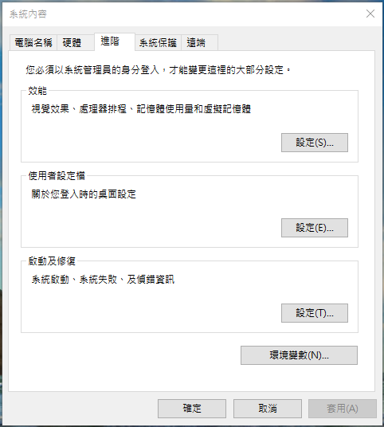
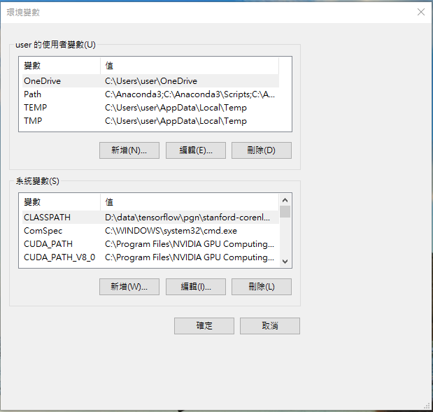
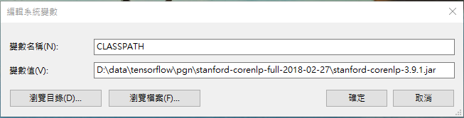

The origin code is from [https://github.com/becxer/cnn-dailymail/](https://github.com/becxer/cnn-dailymail/)

# Instructions
It processes your test data into the binary format expected by the [code](https://github.com/abisee/pointer-generator) for the Tensorflow model , as used in the ACL 2017 paper *[Get To The Point: Summarization with Pointer-Generator Networks](https://arxiv.org/pdf/1704.04368.pdf)*. 


# Environment
| item        | detail                      |
| :---------  | :--------                   |
| OS          | Windows 10 64 bit           |  
| Python      | Python 3.5                  |  
| Tensorflow  | Tensorflow 1.2.1            | 
| CUDA        | CUDA® Toolkit 8.0           |
| cuDNN       | cuDNN v5.1                  |
| stanford-corenlp | stanford-corenlp-3.9.1 |


# How to use?
## 1. Download Stanford CoreNLP
We will need Stanford CoreNLP to tokenize the data. Download it [here](https://stanfordnlp.github.io/CoreNLP/) and unzip it.   
Then add stanford-corenlp-3.7.0.jar(stanford-corenlp-full-2018-02-27/stanford-corenlp-3.9.1.jar) to ypur environment variable.   
In my case,I add below
```
D:\data\tensorflow\pgn\stanford-corenlp-full-2018-02-27\stanford-corenlp-3.9.1.jar
```





You can check if it's working by running
```
echo "Please tokenize this text." | java edu.stanford.nlp.process.PTBTokenizer
```
You should see something like:
```
Please
tokenize
this
text
.
PTBTokenizer tokenized 5 tokens at 68.97 tokens per second.
```
## 2. Process test data into .bin
USAGE : python make_datafiles.py <stories_dir> <out_dir>
```
d:
cd make_datafiles_dondon
python make_datafiles.py  ./stories  ./output
```
## 3. Download Pointer-generator Networks
- https://github.com/abisee/pointer-generator

## 3. Download pretrained model
- [Version for Tensorflow 1.2.1](https://drive.google.com/file/d/0B7pQmm-OfDv7ZUhHZm9ZWEZidDg/view?usp=sharing)


## 4. Download the processed data
User @JafferWilson has provided the processed data, which you can download [here](https://github.com/JafferWilson/Process-Data-of-CNN-DailyMail).

## 5. Summarization your Test data
```
python run_summarization.py --mode=decode --data_path=C:\\tmp\\data\\finished_files\\chunked\\test_*  --vocab_path=D:\\data\\tensorflow\\pgn\\CNN_Daily_Mail\\finished_files\\vocab --log_root=D:\\data\\tensorflow\\pgn --exp_name=pretrained_model --max_enc_steps=500 --max_dec_steps=40 --coverage=1 --single_pass=1
```

